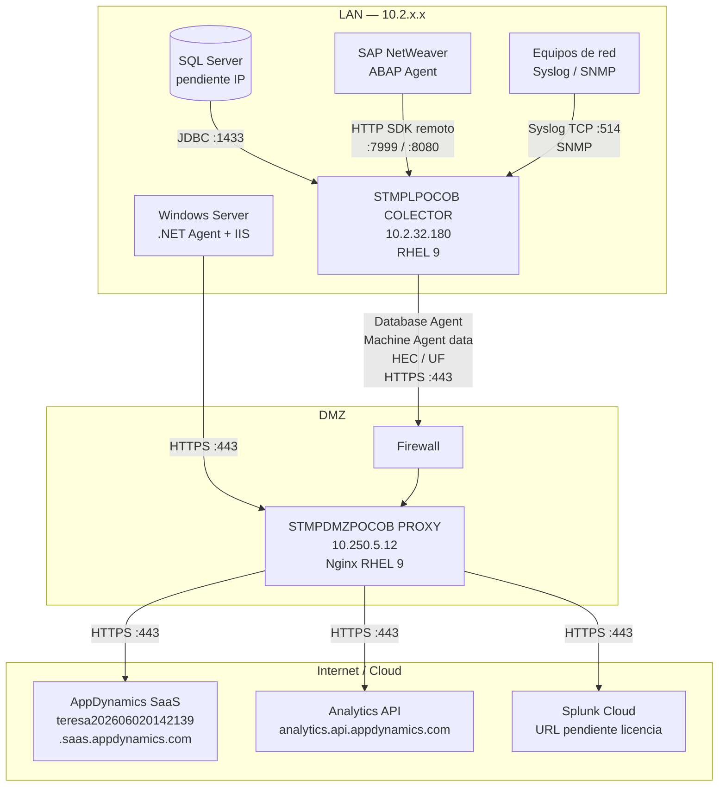
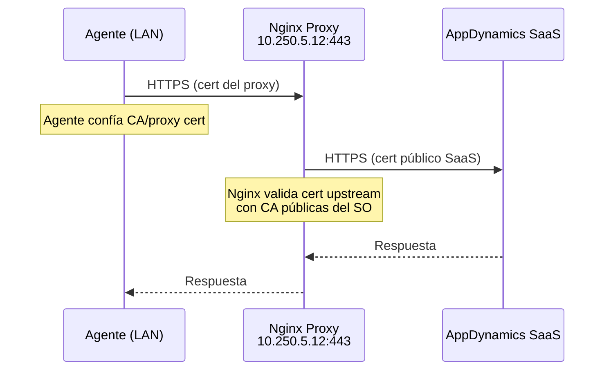
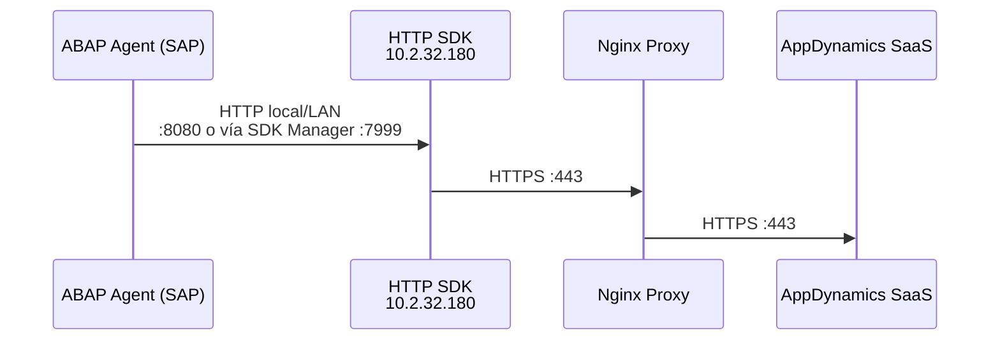
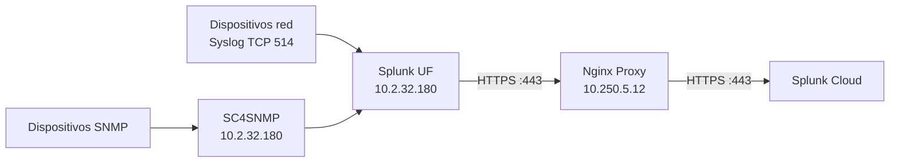

# Arquitectura General — ICASA Observabilidad (DEV)

## Resumen

La solución despliega observabilidad en tres capas:

1. **LAN interna** — Fuentes de datos, agentes AppDynamics y colector Splunk
2. **DMZ** — Proxy Nginx como único punto de salida a Internet (TCP 443)
3. **Cloud** — AppDynamics SaaS y Splunk Cloud

## Diagrama de componentes

## Inventario de servidores

| Rol | Hostname | IP | SO | Componentes |
|-----|----------|-----|-----|-------------|
| Colector | STMPLPOCOB COLECTOR | `10.2.32.180` | RHEL 9 | Database Agent, HTTP SDK, SC4SNMP, Splunk UF |
| Proxy DMZ | STMPDMZPOCOB PROXY | `10.250.5.12` | RHEL 9 | Nginx reverse proxy |
| SQL Server | Pendiente | Pendiente | Windows/Linux | Base de datos monitoreada |
| SAP | Pendiente | Pendiente | Pendiente | ABAP Agent (imports TMS) |
| IIS | Pendiente | Pendiente | Windows Server | .NET Agent + Machine Agent |

## Flujos de tráfico

### AppDynamics — Database Agent, .NET Agent, Machine Agent

**Importante:** No se requiere certificado compuesto. Son dos certificados independientes:

| Conexión | Certificado que valida el cliente | Certificado que presenta el servidor |
|----------|-----------------------------------|--------------------------------------|
| Agente → Proxy | CA interna o autofirmado del proxy | Cert del proxy (`proxy.crt`) |
| Proxy → AppDynamics SaaS | CA públicas (DigiCert, etc.) | Cert de AppDynamics SaaS |

### SAP — HTTP SDK remoto

El ABAP Agent **no** se conecta directamente al proxy. Apunta al HTTP SDK en el colector. El HTTP SDK envía métricas al controller vía proxy.

### Splunk — Syslog y SNMP

## Puertos requeridos

### Firewall LAN → DMZ

| Origen | Destino | Puerto | Protocolo | Uso |
|--------|---------|--------|-----------|-----|
| `10.2.32.180` | `10.250.5.12` | 443 | TCP | Todos los agentes/colectores → Proxy |
| Servidores IIS (LAN) | `10.250.5.12` | 443 | TCP | .NET Agent → Proxy |
| SAP app servers | `10.2.32.180` | 7999, 8080 | TCP | ABAP → HTTP SDK |
| Equipos red | `10.2.32.180` | 514 | TCP | Syslog |

### Firewall DMZ → Internet

| Origen | Destino | Puerto | Protocolo | Uso |
|--------|---------|--------|-----------|-----|
| `10.250.5.12` | `*.saas.appdynamics.com` | 443 | TCP | AppDynamics Controller |
| `10.250.5.12` | `analytics.api.appdynamics.com` | 443 | TCP | Analytics Events (SAP) |
| `10.250.5.12` | Splunk Cloud endpoint | 443 | TCP | Ingesta Splunk |

### Firewall LAN interno

| Origen | Destino | Puerto | Protocolo | Uso |
|--------|---------|--------|-----------|-----|
| `10.2.32.180` | SQL Server | 1433 | TCP | Database Agent JDBC |

## Modelo de certificados TLS

Ver documentación detallada en [certificados-tls.md](../01-proxy-nginx/certificados-tls.md).

### Opción A — CA corporativa (recomendada producción)

1. Generar CSR en el proxy
2. CA interna emite certificado para `appd-proxy.icasa.local` (o FQDN acordado)
3. Instalar cert + key en Nginx
4. Distribuir CA root/intermedia a todos los agentes (Java truststore, Windows cert store)

### Opción B — Autofirmado (DEV / pruebas)

1. Script `scripts/generate-certs-selfsigned.sh` genera CA + cert del proxy
2. Importar CA en truststore de cada agente
3. Validar handshake antes de instalar agentes

## Licencias AppDynamics (DEV)

| Tipo | Estado |
|------|--------|
| Enterprise (APM) | Disponible — ilimitada |
| Database Visibility | Confirmada |
| SAP ABAP Agent | Confirmada |
| Controller | `teresa202606020142139` — expira 07/03/2026 |

## Decisiones de diseño

| Decisión | Valor |
|----------|-------|
| Tipo de proxy | Reverse proxy Nginx |
| Autenticación proxy | No requerida |
| Salida a Internet | Solo desde DMZ (`10.250.5.12`) |
| HTTP SDK SAP | Máquina independiente = colector (`10.2.32.180`) |
| Ambiente documentado | DEV |
| Idioma documentación | Español |

## Referencias

- [Use a Reverse Proxy — AppDynamics](https://help.splunk.com/en/appdynamics-on-premises/controller-deployment/26.4.0/controller-deployment/administer-the-controller/use-a-reverse-proxy)
- [Agent-to-Controller Connections](https://docs.appdynamics.com/appd/21.x/latest/en/application-monitoring/install-app-server-agents/agent-to-controller-connections)
