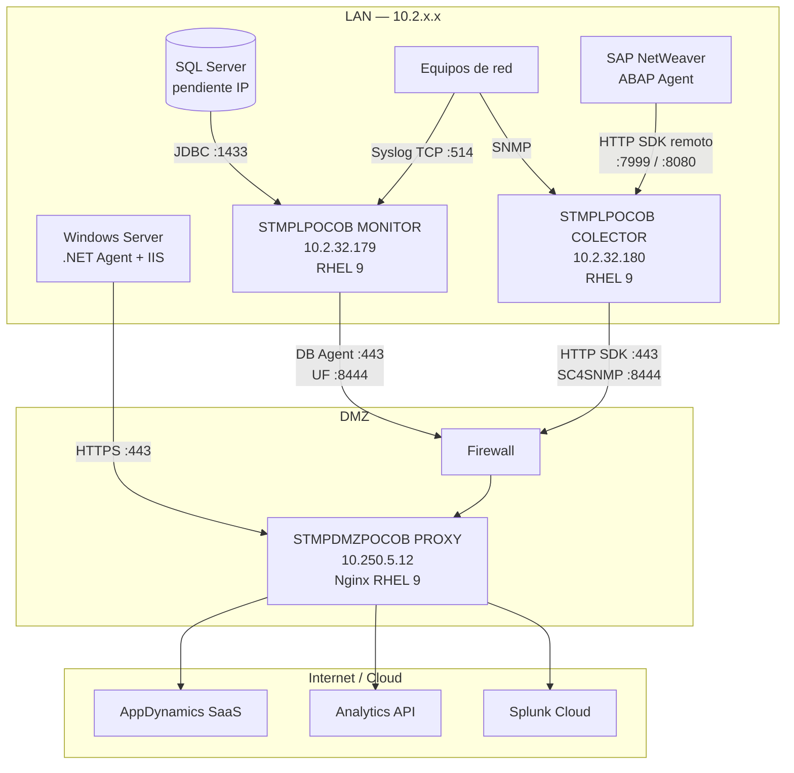
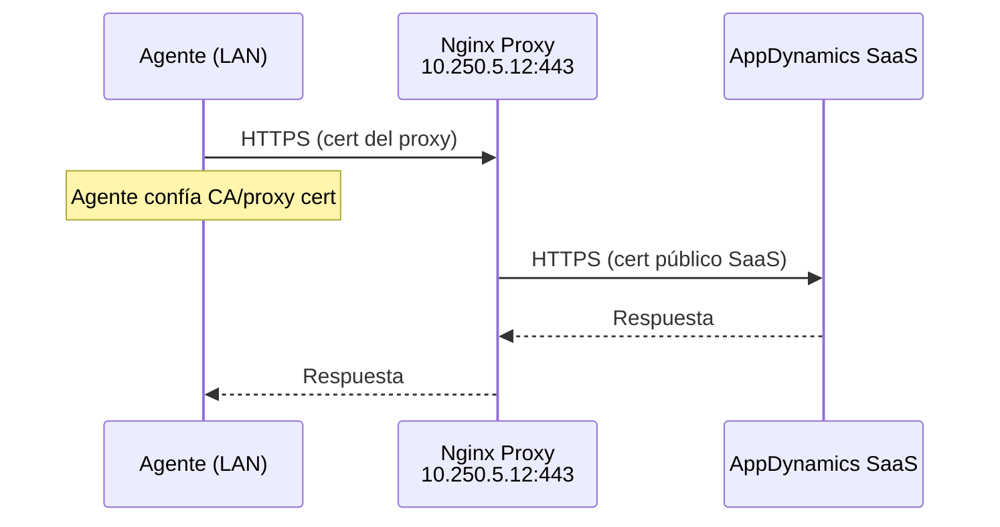
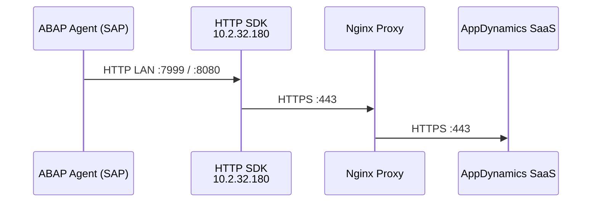
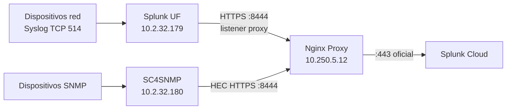

# Arquitectura General — ICASA Observabilidad (DEV)

## Resumen

La solución despliega observabilidad en tres capas:

1. **LAN interna** — Dos servidores RHEL 9 de observabilidad + fuentes de datos
2. **DMZ** — Proxy Nginx como único punto de salida a Internet (TCP 443)
3. **Cloud** — AppDynamics SaaS y Splunk Cloud

## Servidores LAN

| Servidor | IP | Componentes |
|----------|-----|-------------|
| **STMPLPOCOB MONITOR** | `10.2.32.179` | Database Agent, Splunk UF (syslog) |
| **STMPLPOCOB COLECTOR** | `10.2.32.180` | HTTP SDK (SAP), SC4SNMP |

## Diagrama de componentes

## Inventario de servidores

| Rol | Hostname | IP | SO | Componentes |
|-----|----------|-----|-----|-------------|
| Monitoreo APM + Logs | STMPLPOCOB MONITOR | `10.2.32.179` | RHEL 9 | Database Agent, Splunk UF |
| Colector SAP + SNMP | STMPLPOCOB COLECTOR | `10.2.32.180` | RHEL 9 | HTTP SDK, SC4SNMP |
| Proxy DMZ | STMPDMZPOCOB PROXY | `10.250.5.12` | RHEL 9 | Nginx reverse proxy |
| SQL Server | Pendiente | Pendiente | Windows/Linux | Base de datos monitoreada |
| SAP | Pendiente | Pendiente | Pendiente | ABAP Agent (imports TMS) |
| IIS | Pendiente | Pendiente | Windows Server | .NET Agent + Machine Agent |

## Flujos de tráfico

### AppDynamics — Database Agent, .NET Agent, Machine Agent

### SAP — HTTP SDK remoto (colector 10.2.32.180)

El ABAP Agent apunta al HTTP SDK en **10.2.32.180** (colector). El HTTP SDK envía métricas al controller vía proxy.

### Splunk — Syslog y SNMP

## Puertos requeridos

### Firewall LAN → DMZ

| Origen | Destino | Puerto | Protocolo | Uso |
|--------|---------|--------|-----------|-----|
| `10.2.32.179` | `10.250.5.12` | 443 | TCP | Database Agent → Proxy |
| `10.2.32.179` | `10.250.5.12` | 8444 | TCP | Splunk UF → Proxy |
| `10.2.32.180` | `10.250.5.12` | 443 | TCP | HTTP SDK → Proxy |
| `10.2.32.180` | `10.250.5.12` | 8444 | TCP | SC4SNMP HEC → Proxy |
| Servidores IIS (LAN) | `10.250.5.12` | 443 | TCP | .NET Agent → Proxy |
| SAP app servers | `10.2.32.180` | 7999, 8080 | TCP | ABAP → HTTP SDK |
| Equipos red | `10.2.32.179` | 514 | TCP | Syslog |

### Firewall DMZ → Internet

| Origen | Destino | Puerto | Protocolo | Uso |
|--------|---------|--------|-----------|-----|
| `10.250.5.12` | `*.saas.appdynamics.com` | 443 | TCP | AppDynamics Controller |
| `10.250.5.12` | `analytics.api.appdynamics.com` | 443 | TCP | Analytics Events (SAP) |
| `10.250.5.12` | `*.splunkcloud.com` | **443** | TCP | Proxy → Splunk Cloud (HEC). **No usar 8444 hacia Internet** |

### Firewall LAN interno

| Origen | Destino | Puerto | Protocolo | Uso |
|--------|---------|--------|-----------|-----|
| `10.2.32.179` | SQL Server | 1433 | TCP | Database Agent JDBC |
| `10.2.32.180` | Dispositivos red | 161 | UDP | SC4SNMP polling |
| Dispositivos red | `10.2.32.180` | 162 | UDP | SNMP traps |

## Modelo de certificados TLS

Ver [certificados-tls.md](../01-proxy-nginx/certificados-tls.md).

## Licencias AppDynamics (DEV)

| Tipo | Estado |
|------|--------|
| Enterprise (APM) | Disponible — ilimitada |
| Database Visibility | Confirmada |
| SAP ABAP Agent | Confirmada |
| Controller | `teresa202606020142139` — expira 07/03/2026 |

## Política de puertos (requisito cliente)

| Dirección | Puerto | Descripción |
|-----------|--------|-------------|
| LAN → Proxy | **443** | Tráfico AppDynamics (agentes APM, HTTP SDK) |
| LAN → Proxy | **8444** | Tráfico Splunk (UF, SC4SNMP HEC) — Nginx separa por listener |
| LAN → Proxy | **8443** | Analytics Events API (SAP), si aplica |
| **Proxy → Internet** | **443 únicamente** | Hacia AppDynamics SaaS y Splunk Cloud |

Nginx recibe en `:8444` desde la LAN y reenvía a Splunk Cloud en `:443`. El 8444 **no sale a Internet**.

Ver [puertos-splunk-cloud.md](../05-splunk-syslog/puertos-splunk-cloud.md).

## Decisiones de diseño

| Decisión | Valor |
|----------|-------|
| Tipo de proxy | Reverse proxy Nginx |
| Autenticación proxy | No requerida |
| Salida a Internet | Solo **:443** desde DMZ (`10.250.5.12`) |
| Separación tráfico Splunk | Listener **:8444** interno en proxy |
| Database Agent + Splunk UF | `10.2.32.179` (MONITOR) |
| HTTP SDK SAP + SC4SNMP | `10.2.32.180` (COLECTOR) |
| Ambiente documentado | DEV |
| Idioma documentación | Español |

## Referencias

- [Use a Reverse Proxy — AppDynamics](https://help.splunk.com/en/appdynamics-on-premises/controller-deployment/26.4.0/controller-deployment/administer-the-controller/use-a-reverse-proxy)
- [Agent-to-Controller Connections](https://docs.appdynamics.com/appd/21.x/latest/en/application-monitoring/install-app-server-agents/agent-to-controller-connections)
