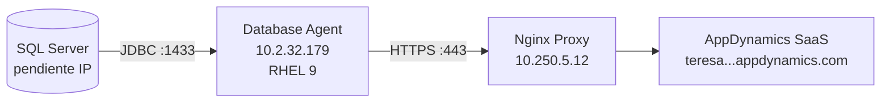
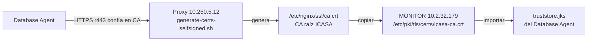

# Database Agent — RHEL 9 + SQL Server

Servidor agente: **STMPLPOCOB MONITOR** — `10.2.32.179`  
Ambiente: **DEV**

## Arquitectura



## Requisitos

| Requisito | Detalle |
|-----------|---------|
| SO agente | RHEL 9 x86_64 |
| Java | OpenJDK 11 o superior (solicitar JDK 8+ mínimo AppDynamics; recomendado 11/17) |
| Red agente → SQL | TCP 1433 |
| Red agente → proxy | TCP 443 |
| Red proxy → Internet | TCP 443 |
| Licencia | Database Visibility (confirmada) |
| Usuario SQL | Usuario dedicado con permisos GRANT (pendiente DBA) |

## Permisos SQL Server requeridos

Solicitar al DBA la creación de un usuario de monitoreo con los permisos que indica la documentación oficial de AppDynamics Database Visibility. Como mínimo:

```sql
-- Ejemplo base — ajustar según versión SQL Server y documentación AppDynamics
CREATE LOGIN [appd_monitor] WITH PASSWORD = 'CAMBIAR_PASSWORD';
USE master;
CREATE USER [appd_monitor] FOR LOGIN [appd_monitor];
GRANT VIEW SERVER STATE TO [appd_monitor];
GRANT VIEW ANY DEFINITION TO [appd_monitor];

-- Por cada base monitoreada:
USE [nombre_base];
CREATE USER [appd_monitor] FOR LOGIN [appd_monitor];
GRANT VIEW DATABASE STATE TO [appd_monitor];
```

> Validar permisos exactos en: [Database Agent — SQL Server Permissions](https://help.splunk.com/en/appdynamics-saas/database-visibility)

## Instalación

### Opción A — Script automatizado

```bash
cd ICASA_Observability
cp .env.example .env
# Completar variables APPD_* y SQL_*
sudo ./scripts/install-db-agent.sh
```

### Opción B — Manual

#### 1. Instalar Java

```bash
sudo dnf install -y java-17-openjdk java-17-openjdk-devel
java -version
# openjdk version "17.x"
```

#### 2. Descargar Database Agent

Desde [accounts.appdynamics.com/downloads](https://accounts.appdynamics.com/downloads):

- Filtrar: **Database Agent** → versión más reciente compatible con SaaS
- Descargar ZIP para Linux x64

```bash
sudo mkdir -p /opt/appdynamics
sudo unzip db-agent-*.zip -d /opt/appdynamics/
sudo mv /opt/appdynamics/db-agent-* /opt/appdynamics/db-agent
sudo chown -R appdynamics:appdynamics /opt/appdynamics/db-agent
```

#### 3. Configurar controller-info.xml

```bash
sudo cp configs/database-agent/controller-info.xml /opt/appdynamics/db-agent/conf/
sudo nano /opt/appdynamics/db-agent/conf/controller-info.xml
# Reemplazar placeholders con valores de .env
```

Valores DEV:

```xml
<controller-host>10.250.5.12</controller-host>
<controller-port>443</controller-port>
<controller-ssl-enabled>true</controller-ssl-enabled>
<account-name>teresa202606020142139</account-name>
<account-access-key>CAMBIAR</account-access-key>
```

> El agente apunta al **proxy** (`10.250.5.12`), no al FQDN SaaS directamente.

#### 4. Configurar truststore TLS (certificado autofirmado del proxy)

El agente se conecta al **proxy** (`10.250.5.12:443`) con HTTPS. El proxy usa un **certificado autofirmado**, así que el agente Java debe confiar en la **CA raíz** que firmó ese certificado.



**Paso 4.1 — En el PROXY (`10.250.5.12`)** — generar certs (si no se hizo con `install-nginx-proxy.sh`):

```bash
sudo ./scripts/generate-certs-selfsigned.sh
# Crea: /etc/nginx/ssl/ca.crt  ← este archivo hay que llevarlo al agente
```

**Paso 4.2 — En el MONITOR (`10.2.32.179`)** — copiar la CA del proxy:

```bash
# Opción A: script automático (requiere SSH al proxy)
sudo ./scripts/fetch-proxy-ca.sh

# Opción B: scp manual
sudo scp root@10.250.5.12:/etc/nginx/ssl/ca.crt /etc/pki/tls/certs/icasa-ca.crt
```

**Paso 4.3 — Importar CA en el truststore del agente:**

```bash
sudo ./scripts/install-truststore-agent.sh \
  --ca-cert /etc/pki/tls/certs/icasa-ca.crt \
  --agent-home /opt/appdynamics/db-agent
```

**Paso 4.4 — Verificar:**

```bash
keytool -list -keystore /opt/appdynamics/db-agent/conf/truststore.jks -storepass changeit | grep icasa
# Debe mostrar: icasa-ca
```

> **No es el certificado de AppDynamics SaaS.** Es solo la CA del proxy interno. El proxy valida AppDynamics con las CA públicas del sistema; el agente solo necesita confiar en el proxy.

Ver también: [certificados-tls.md](../01-proxy-nginx/certificados-tls.md)

#### 5. Configurar credenciales SQL Server

```bash
echo 'CAMBIAR_PASSWORD_SQL' | sudo tee /opt/appdynamics/db-agent/conf/sql-password.txt
sudo chmod 600 /opt/appdynamics/db-agent/conf/sql-password.txt
sudo chown appdynamics:appdynamics /opt/appdynamics/db-agent/conf/sql-password.txt
```

#### 6. Instalar servicio systemd

```bash
sudo cp configs/database-agent/db-agent.service /etc/systemd/system/
sudo systemctl daemon-reload
sudo systemctl enable db-agent
sudo systemctl start db-agent
sudo systemctl status db-agent
```

#### 7. Registrar collector en Controller UI

1. Acceder a `https://teresa202606020142139.saas.appdynamics.com/controller/`
2. Ir a **Databases** → **Collectors** → **Register a Collector**
3. Agregar instancia SQL Server con host, puerto, credenciales

## Verificación

```bash
# Logs del agente
sudo tail -f /opt/appdynamics/db-agent/logs/agent.log

# Buscar conexión exitosa
grep -i "connected\|registered\|started" /opt/appdynamics/db-agent/logs/agent.log

# Test JDBC local (opcional)
/opt/appdynamics/db-agent/db-agent.sh -version
```

En el Controller UI:
- **Databases** → verificar collector `ICASA-DEV-DB-AGENT` en estado **Running**
- Métricas de wait stats, queries top, etc. visibles tras 5-10 minutos

## Troubleshooting

| Síntoma | Causa | Solución |
|---------|-------|----------|
| SSL handshake failure | CA no importada | Ejecutar `install-truststore-agent.sh` |
| Connection refused 443 | Firewall LAN→DMZ | Verificar regla hacia `10.250.5.12` |
| JDBC login failed | Usuario SQL incorrecto | Validar con DBA permisos GRANT |
| Agent not registered | Access Key incorrecta | Verificar `.env` / controller-info.xml |
| 502 desde proxy | Proxy no alcanza SaaS | Ver logs Nginx en DMZ |

## Referencias

- [Install the Database Agent](https://help.splunk.com/en/appdynamics-saas/database-visibility/25.8.0/administer-the-database-agent/install-the-database-agent)
- [Database Agent Properties](https://help.splunk.com/en/appdynamics-saas/database-visibility/25.8.0/administer-the-database-agent/configure-the-database-agent/database-agent-configuration-properties/database-agent-properties)
