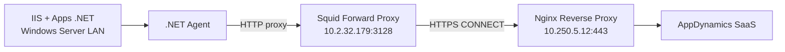

# .NET Agent + IIS — Windows Server

Ambiente: **DEV**  
Arquitectura: **doble proxy** — ver [arquitectura-doble-proxy.md](../00-arquitectura/arquitectura-doble-proxy.md)

## Arquitectura



## Configuración del agente

| Campo | Valor |
|-------|-------|
| Server (Controller) | `appd-proxy.icasa.local` o `10.250.5.12` |
| Port | `443` |
| Enable SSL | ✓ |
| Enable TLS 1.2 | ✓ |
| Use proxy | ✓ |
| **Proxy address** | `10.2.32.179` (Squid — **no** el Nginx) |
| **Proxy port** | `3128` |

> Si hay problemas de conexión, ver [troubleshooting-doble-proxy.md](troubleshooting-doble-proxy.md)

## Requisitos

| Requisito | Detalle |
|-----------|---------|
| SO | Windows Server 2016+ |
| IIS | Instalado y en ejecución |
| Forward proxy | Squid en `10.2.32.179:3128` accesible desde el servidor |
| Certificado CA | `ICASA-Dev-CA` (`ca.crt`) en `Cert:\LocalMachine\Root` |
| DNS | `appd-proxy.icasa.local` → `10.250.5.12` (o usar IP) |

## Instalación

### 1. Descargar e instalar agente

Desde [accounts.appdynamics.com/downloads](https://accounts.appdynamics.com/downloads) → **.NET Agent** → MSI x64.

### 2. Importar CA del proxy

```powershell
Import-Certificate -FilePath "C:\certs\ca.crt" -CertStoreLocation Cert:\LocalMachine\Root
```

La CA se genera en el proxy con `generate-certs-selfsigned.sh` → archivo `/etc/nginx/ssl/ca.crt`.

### 3. Configurar config.xml

Plantilla: `configs/dotnet-agent/config.xml`

```xml
<controller host="appd-proxy.icasa.local" port="443" ssl="true" enable_tls12="true">
  <account name="teresa202606020142139" password="ACCESS_KEY" />
  <application name="ICASA-DEV-IIS" />
  <proxy host="10.2.32.179" port="3128" enabled="true" />
</controller>
```

### 4. Reiniciar y verificar

```powershell
Restart-Service AppDynamics.Agent.Coordinator
iisreset
```

## Troubleshooting

Ver guía completa: [troubleshooting-doble-proxy.md](troubleshooting-doble-proxy.md)

## Referencias

- [Configure Agent Properties — .NET](https://help.splunk.com/en/appdynamics-saas/application-performance-monitoring/26.4.0/install-app-server-agents/.net-agent/administer-the-.net-agent/configure-agent-properties)
- [Controller Element — Proxy](https://help.splunk.com/en/appdynamics-saas/application-performance-monitoring/26.4.0/install-app-server-agents/.net-agent/administer-the-.net-agent/.net-agent-configuration-properties/controller-element)
