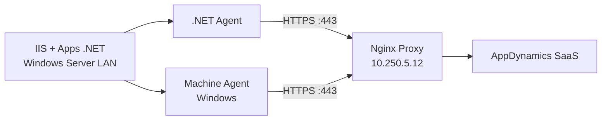

# .NET Agent + IIS — Windows Server

Ambiente: **DEV**  
Conectividad: Agentes → Proxy `10.250.5.12:443` → AppDynamics SaaS

## Arquitectura



## Requisitos

| Requisito | Detalle |
|-----------|---------|
| SO | Windows Server 2016+ (validar versión exacta) |
| IIS | Instalado y en ejecución |
| .NET | Versión pendiente validar |
| Red | TCP 443 hacia `10.250.5.12` |
| Certificado CA | CA del proxy en `Cert:\LocalMachine\Root` |
| Licencia | Enterprise (confirmada) |

## Instalación .NET Agent

### 1. Descargar agente

Desde [accounts.appdynamics.com/downloads](https://accounts.appdynamics.com/downloads):

- Filtrar: **.NET Agent** → versión más reciente
- Descargar instalador MSI para Windows x64

### 2. Instalar

```powershell
# Ejecutar como Administrador
msiexec /i AppDynamics-DotNetAgent-x64-*.msi /quiet
```

O usar el **AppDynamics .NET Agent Configuration Utility** incluido en el instalador.

### 3. Importar CA del proxy

```powershell
# Copiar ca.crt del proxy al servidor Windows
Import-Certificate -FilePath "C:\certs\icasa-ca.crt" `
  -CertStoreLocation Cert:\LocalMachine\Root
```

### 4. Configurar config.xml

Ubicación: `%ProgramData%\AppDynamics\DotNetAgent\Config\config.xml`

Usar plantilla: `configs/dotnet-agent/config.xml`

Parámetros clave:

```xml
<controller host="10.250.5.12" port="443" ssl="true" enable_tls12="true">
  <account name="teresa202606020142139" password="CAMBIAR_ACCESS_KEY" />
  <application name="ICASA-DEV-IIS" />
  <proxy host="10.250.5.12" port="443" enabled="true" />
</controller>
```

> **Nota sobre reverse proxy:** En este escenario el `controller host` es el proxy. Nginx reescribe el header `Host` hacia el FQDN SaaS real. El elemento `<proxy>` puede omitirse si el controller host ya es el proxy; incluirlo documenta explícitamente el patrón de red.

### 5. Instrumentación automática IIS

```xml
<iis>
  <automatic />
</iis>
```

Esto instrumenta automáticamente todos los application pools de IIS.

### 6. Reiniciar servicios

```powershell
Restart-Service AppDynamics.Agent.Coordinator
iisreset
```

## Instalación Machine Agent (Windows)

El Machine Agent recopila métricas de OS (CPU, RAM, disco, red).

### 1. Descargar Machine Agent

Desde portal AppDynamics → **Machine Agent** → Windows ZIP.

### 2. Instalar

```powershell
Expand-Archive machineagent-bundle-*.zip -DestinationPath "C:\Program Files\AppDynamics\MachineAgent"
```

### 3. Configurar controller-info.xml

```xml
<controller-host>10.250.5.12</controller-host>
<controller-port>443</controller-port>
<controller-ssl-enabled>true</controller-ssl-enabled>
<account-name>teresa202606020142139</account-name>
<account-access-key>CAMBIAR_ACCESS_KEY</account-access-key>
```

### 4. Instalar como servicio Windows

```powershell
cd "C:\Program Files\AppDynamics\MachineAgent"
.\InstallService.bat
Start-Service AppDynamicsMachineAgent
```

## Verificación

1. Controller UI → **Applications** → verificar app `ICASA-DEV-IIS`
2. Controller UI → **Servers** → verificar Machine Agent registrado
3. Generar tráfico HTTP al sitio IIS y verificar Business Transactions

```powershell
# Verificar logs .NET Agent
Get-Content "C:\ProgramData\AppDynamics\DotNetAgent\Logs\*.log" -Tail 50
```

## Troubleshooting

| Síntoma | Solución |
|---------|----------|
| 407 Proxy Authentication Required | Proxy no requiere auth — verificar config.xml |
| SSL/TLS error | Importar CA del proxy en cert store Windows |
| No BT data | Verificar iisreset después de instalar agente |
| Machine Agent offline | Verificar conectividad :443 a `10.250.5.12` |

## Referencias

- [Configure Agent Properties — .NET](https://help.splunk.com/en/appdynamics-saas/application-performance-monitoring/26.4.0/install-app-server-agents/.net-agent/administer-the-.net-agent/configure-agent-properties)
- [Controller Element — Proxy](https://help.splunk.com/en/appdynamics-saas/application-performance-monitoring/26.4.0/install-app-server-agents/.net-agent/administer-the-.net-agent/.net-agent-configuration-properties/controller-element)
