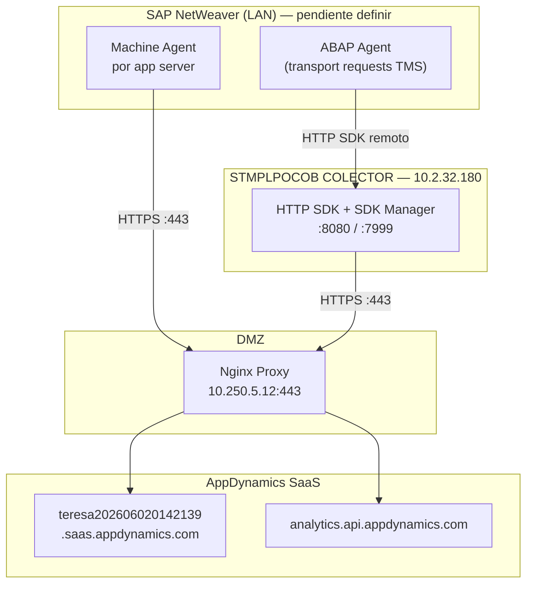

# SAP Monitoring — ICASA (DEV)

Manual ampliado basado en *Manual técnico de instalación — SAP Monitoring v2.2* y documentación oficial [SAP Monitoring Using Cisco AppDynamics](https://help.splunk.com/en/appdynamics-sap-agent/sap-monitoring/sap-monitoring-using-cisco-appdynamics).

## Arquitectura ICASA



### Decisiones ICASA

| Componente | Ubicación | Notas |
|-----------|-----------|-------|
| ABAP Agent | SAP (imports TMS) | Equipo BASIS |
| Machine Agent | Cada SAP app server | Métricas OS + eventos SAP |
| HTTP SDK | Colector `10.2.32.180` | **Remoto** — ABAP apunta aquí |
| Controller | `teresa202606020142139` | DEV — no usar controller anterior |
| Instaladores | Portal oficial AppDynamics | Versión más reciente compatible |

## Requisitos generales

- Acceso al Application Server SAP (NetWeaver)
- Usuario administrador SO en servidores SAP (Machine Agent)
- Comunicación SAP app servers → HTTP SDK colector: puertos **7999** (SDK Manager) y **8080+** (HTTP SDK instances)
- Comunicación colector/Machine Agent → proxy: **TCP 443**
- Proxy → Internet: **TCP 443** hacia AppDynamics SaaS
- Directorio `/opt/appdynamics/` en servidores Linux
- JDK 1.8+ en servidores Linux
- Licencia SAP ABAP Agent (confirmada)

## Componentes

| Componente | Función |
|-----------|---------|
| **ABAP Agent** | Monitoreo de transacciones de negocio SAP |
| **HTTP SDK** | Puente ABAP → AppDynamics Controller (C++ SDK) |
| **Machine Agent** | Métricas OS + HTTP listener eventos (puerto 8293) |
| **SNP CrystalBridge Monitoring** | Métricas sistema SAP (antes Datavard Insights) |

---

## Fase 1 — Descarga de instaladores

### Portal oficial (recomendado)

1. Acceder a [accounts.appdynamics.com/downloads](https://accounts.appdynamics.com/downloads)
2. Buscar **SAP ABAP Agent** — versión más reciente compatible con controller SaaS
3. Descargar ZIP (ej. `APPD-SAP-XX.X.X.zip`)

> El enlace Google Drive del manual v2.2 ya no está disponible. Usar portal oficial.

### Contenido del ZIP

```
APPD-SAP-XX.X.X/
├── 0-AbapAgentUpgrade-*/       # Cleanup pre-upgrade (v25.2+)
├── 1-AbapAgentDeps-*/          # Dependencias (Reuse Library, CrystalBridge)
├── 2-AbapAgent740-*/           # ABAP Agent 7.4+
├── 3-Enhancements-*/           # Enhancements separados (v25.2+)
├── SapAgent-*/appdhttpsdk-*/   # HTTP SDK
└── readme.txt                  # Orden de imports por versión
```

---

## Fase 2 — Instalación ABAP Agent (equipo BASIS)

> **Importante:** Realizar imports fuera de horario pico. Los enhancements recompilan objetos SAP estándar.

### 2.1 Dependencias ABAP Agent

Carpeta: `1-AbapAgentDeps-*`

1. Copiar data files y cofiles a directorios SAP (`/usr/sap/trans/data` y `/usr/sap/trans/cofiles`)
2. Importar transport requests en **STMS** en este orden (v22.5.0 de referencia):

| Orden | Transport | Descripción |
|-------|-----------|-------------|
| 1 | DT1K900642 | Datavard Reuse Library 2205 |
| 2 | DT1K900643 | Datavard Insights 2205 (0099) |
| 3 | NSQK907978 | Datavard Insights AppDynamics Content 2205 |

> En versiones recientes (25.x), los nombres de transports cambian. Consultar `readme.txt` del ZIP descargado.

### 2.2 ABAP Agent 740

Carpeta: `2-AbapAgent740-*`

**Pre-requisito:** Dependencias ya importadas.

1. Copiar data/cofiles a directorios SAP
2. Importar en STMS:

| Orden | Transport | Descripción |
|-------|-----------|-------------|
| 1 | ED2K981224 | AppDynamics ABAP agent 740 22.5.0 |

### 2.3 Procedimiento STMS (referencia)

```
STMS → Import Queue → Importar en orden
```

Alternativa upload manual (sin acceso OS):
```
CG3Z → subir cofiles/data → STMS → Extras → Other Requests → Add
```

Ver: [SAP Community — Upload transport files](https://community.sap.com/t5/technology-blog-posts-by-members/upload-transport-files-from-sap/ba-p/13580710)

---

## Fase 3 — Machine Agent en SAP app servers

### Descarga

Portal AppDynamics → **Machine Agent** → Linux x64 (versión más reciente).

### Instalación

```bash
sudo mkdir -p /opt/appdynamics/machine-agent
sudo unzip machineagent-bundle-64bit-linux-*.zip -d /opt/appdynamics/machine-agent/

# Configurar controller-info.xml
sudo cp controller-info.xml /opt/appdynamics/machine-agent/conf/
```

`controller-info.xml`:

```xml
<controller-host>10.250.5.12</controller-host>
<controller-port>443</controller-port>
<controller-ssl-enabled>true</controller-ssl-enabled>
<account-name>teresa202606020142139</account-name>
<account-access-key>CAMBIAR</account-access-key>
```

### Habilitar HTTP Listener (eventos SAP)

```bash
cd /opt/appdynamics/machine-agent
./bin/machine-agent -Dmetric.http.listener=true \
  -Dmetric.http.listener.port=8293 \
  -Dmetric.http.listener.host=0.0.0.0
```

Verificar: `Started APPDYNAMICS Machine Agent Successfully`

---

## Fase 4 — HTTP SDK en colector (10.2.32.180)

El HTTP SDK corre en el **colector RHEL 9**, no en los servidores SAP. Los ABAP Agents se conectan remotamente.

### 4.1 Requisitos colector

- RHEL 9 x64, glibc 2.11+
- JDK 1.8+ (Java 8_401+ recomendado para SDK Manager)
- `/opt/appdynamics/` con permisos completos al usuario SO
- Puertos abiertos: **7999** (SDK Manager), **8080+** (instancias HTTP SDK)
- Conectividad :443 hacia proxy `10.250.5.12`

### 4.2 Instalación

```bash
# Copiar desde ZIP SAP: SapAgent-*/appdhttpsdk-latest/
sudo mkdir -p /opt/appdynamics/appdhttpsdk
sudo cp -r appdhttpsdk-latest/* /opt/appdynamics/appdhttpsdk/
sudo chmod -R 755 /opt/appdynamics/appdhttpsdk
```

Descargar C++ SDK adicional si el ZIP lo requiere (ver readme.txt del paquete SAP).

### 4.3 Configuración SDK Manager

Acceder vía SAP GUI → transacción `/DVD/APPD_CUST` o interfaz SDK Manager (`https://10.2.32.180:7999`).

| Campo | Valor DEV |
|-------|-----------|
| Hostname | `10.250.5.12` (proxy) |
| Port | `443` |
| SSL | Enable |
| Account | `teresa202606020142139` |
| Access Key | Ver `.env` |
| Application Name | `ICASA-DEV-SAP` |
| Tier Name | SID del sistema SAP |
| Remote HTTP SDK | **Enable** |
| SDK Manager Port | `7999` |
| Use SSL | ✓ |

### 4.4 Configuración ABAP Agent → HTTP SDK remoto

En `/DVD/APPD_CUST`:

| Campo | Valor |
|-------|-------|
| Remote HTTP SDK | Enable |
| SDK Manager Port | 7999 |
| SDK Manager Host | `10.2.32.180` |
| Machine Agent Port | 8293 |

### 4.5 Analytics Events API

| Campo | Valor |
|-------|-------|
| URL | `10.250.5.12:8443` (proxy analytics) o vía proxy principal |
| Port | `443` |
| Account | `teresa202606020142139` |
| Key | Access Key del controller |
| Analytics Events API active | ✓ |

> El proxy Nginx expone analytics en puerto **8443** (ver `configs/nginx/appdynamics-upstream.conf`).

---

## Fase 5 — Activación

1. Verificar HTTP SDK instances running (SDK Manager UI)
2. Verificar Machine Agent en cada app server
3. En `/DVD/APPD_CUST` → modo edición → **Activar integración**
4. Revisar status de conexión en SAP GUI
5. Verificar en Controller UI → Applications → `ICASA-DEV-SAP`

## Autorizaciones SAP

Configurar roles/autorizaciones según documentación AppDynamics. Ver [SAP Authorizations](https://help.splunk.com/en/appdynamics-sap-agent/sap-monitoring/sap-authorizations).

## Troubleshooting

| Síntoma | Causa | Solución |
|---------|-------|----------|
| ABAP Agent no conecta | HTTP SDK no running | Verificar SDK Manager en 10.2.32.180:7999 |
| SSL error en SDK | CA no confiada | Importar CA proxy en colector |
| Import RC=8 | Orden incorrecto transports | Seguir readme.txt del ZIP |
| No BT en controller | Integración no activada | Activar en /DVD/APPD_CUST |
| Machine Agent offline | Firewall SAP→proxy | Abrir :443 hacia 10.250.5.12 |

## Referencias

- [Install SAP Netweaver Systems](https://help.splunk.com/en/appdynamics-sap-agent/sap-monitoring/install-sap-netweaver-systems)
- [SAP Monitoring Using Cisco AppDynamics](https://help.splunk.com/en/appdynamics-sap-agent/sap-monitoring/sap-monitoring-using-cisco-appdynamics)
- Manual interno v2.2 (ICASA)
