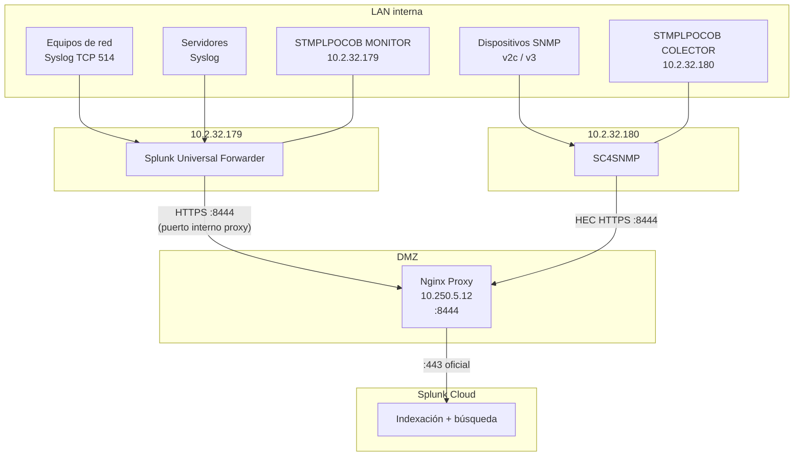

# Splunk Cloud — Arquitectura de ingesta

Ambiente: **DEV**  
Destino: **Splunk Cloud** (URL pendiente por licencia)

## Servidores LAN

| Servidor | IP | Rol Splunk |
|----------|-----|------------|
| STMPLPOCOB MONITOR | `10.2.32.179` | Splunk UF — recibe syslog |
| STMPLPOCOB COLECTOR | `10.2.32.180` | SC4SNMP — polling SNMP |

## Arquitectura

## Componentes

| Componente | Rol | Servidor |
|-----------|-----|----------|
| **Universal Forwarder (UF)** | Recibe syslog TCP 514, reenvía a Splunk Cloud | `10.2.32.179` |
| **SC4SNMP** | Polling SNMP + traps → HEC | `10.2.32.180` |
| **Nginx Proxy** | Reverse proxy TLS hacia Splunk Cloud | `10.250.5.12` |
| **Splunk Cloud** | Indexación, búsqueda, dashboards | SaaS |

## Por qué dos servidores

- **MONITOR (`.179`):** concentración de logs syslog y Database Agent APM
- **COLECTOR (`.180`):** servicios de ingesta SNMP y HTTP SDK SAP (carga separada)

SC4SNMP envía datos vía HEC **directamente al proxy** desde `.180`, sin pasar por el UF en `.179`.

## Índices sugeridos (pendiente confirmar)

| Índice | Sourcetype sugerido | Fuente |
|--------|---------------------|--------|
| `network` | `syslog:network` | Equipos de comunicación → `.179` |
| `os` | `syslog:linux` / `syslog:windows` | Servidores → `.179` |
| `snmp` | `snmp:trap`, `snmp:polling` | SC4SNMP en `.180` |

## Flujo de datos

1. Dispositivos de red envían **syslog TCP 514** a `10.2.32.179`
2. UF en MONITOR reenvía vía proxy `:8444` a Splunk Cloud
3. SC4SNMP en COLECTOR hace polling SNMP en LAN
4. SC4SNMP envía métricas/traps vía HEC al proxy `:8444`
5. Proxy termina TLS y reenvía a Splunk Cloud

## Pendientes

- URL Splunk Cloud (HEC endpoint y UF destination)
- Token HEC para SC4SNMP y UF
- Inventario dispositivos SNMP
- Definición final de índices

Ver [pendientes.md](../00-arquitectura/pendientes.md).

## Puertos — diseño aprobado

- **LAN → Proxy:** `:8444` (Splunk HEC) — Nginx separa del tráfico AppDynamics (`:443`)
- **Proxy → Internet:** `:443` únicamente (requisito cliente)

Ver [puertos-splunk-cloud.md](puertos-splunk-cloud.md).

## Referencias

- [Splunk Universal Forwarder](https://docs.splunk.com/Documentation/Forwarder)
- [Splunk Connect for SNMP](https://splunk.github.io/splunk-connect-for-snmp/main/)
