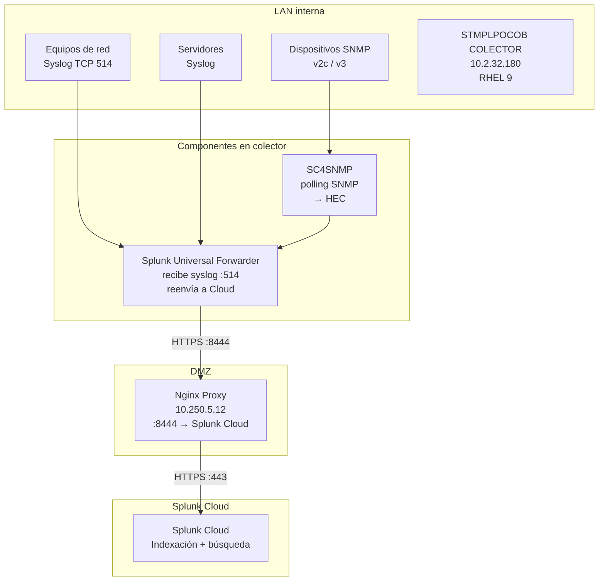

# Splunk Cloud — Arquitectura de ingesta

Ambiente: **DEV**  
Destino: **Splunk Cloud** (URL pendiente por licencia)

## Arquitectura recomendada

## Componentes

| Componente | Rol | Ubicación |
|-----------|-----|-----------|
| **Universal Forwarder (UF)** | Recibe syslog, reenvía a Splunk Cloud | Colector `10.2.32.180` |
| **SC4SNMP** | Polling SNMP + traps → HEC | Colector `10.2.32.180` |
| **Nginx Proxy** | Reverse proxy TLS hacia Splunk Cloud | DMZ `10.250.5.12` |
| **Splunk Cloud** | Indexación, búsqueda, dashboards | SaaS |

## Por qué Universal Forwarder y no Heavy Forwarder

Para este diseño ICASA recomendamos **UF** en el colector porque:

- Footprint mínimo en RHEL 9
- Soporta inputs syslog TCP nativos
- Puede configurarse con `outputs.conf` apuntando al proxy
- SC4SNMP envía directamente vía HEC al proxy

Si en el futuro se requiere parsing/enriquecimiento local, evaluar migrar a Heavy Forwarder.

## Índices sugeridos (pendiente confirmar)

| Índice | Sourcetype sugerido | Fuente |
|--------|---------------------|--------|
| `network` | `syslog:network` | Equipos de comunicación |
| `os` | `syslog:linux` / `syslog:windows` | Servidores |
| `snmp` | `snmp:trap`, `snmp:polling` | SC4SNMP |
| `sap` | `sap:syslog` | SAP (si aplica) |

## Flujo de datos

1. Dispositivos de red envían **syslog TCP 514** al colector
2. UF recibe, taggea con sourcetype y reenvía vía proxy a Splunk Cloud
3. SC4SNMP hace polling SNMP en LAN, envía métricas/traps vía HEC al proxy
4. Proxy termina TLS y reenvía a endpoint Splunk Cloud

## Pendientes

- URL Splunk Cloud (HEC endpoint y UF destination)
- Token HEC para SC4SNMP y UF
- Inventario dispositivos SNMP
- Definición final de índices

Ver [pendientes.md](../00-arquitectura/pendientes.md).

## Referencias

- [Splunk Universal Forwarder](https://docs.splunk.com/Documentation/Forwarder)
- [Splunk Cloud — Data Management](https://docs.splunk.com/Documentation/SCloud)
- [Splunk Connect for SNMP](https://splunk.github.io/splunk-connect-for-snmp/main/)
