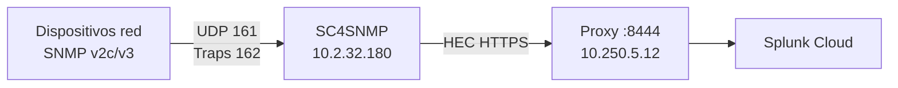

# Splunk Connect for SNMP (SC4SNMP)

Colector: **STMPLPOCOB COLECTOR** — `10.2.32.180`  
Red: **LAN interna** (polling de dispositivos de red)  
Destino: **Splunk Cloud** vía proxy DMZ

Documentación oficial: [Splunk Connect for SNMP](https://splunk.github.io/splunk-connect-for-snmp/main/)

## Arquitectura



## Opciones de despliegue

| Método | Recomendación ICASA | Notas |
|--------|---------------------|-------|
| Docker Compose | **Recomendado DEV** | Más simple en RHEL 9 sin K8s |
| MicroK8s | Alternativa | Si ya hay cluster K8s |
| Helm | Producción futura | Escalabilidad HA |

Para ICASA DEV se recomienda **Docker Compose** sobre RHEL 9.

## Requisitos

- RHEL 9 con Docker/Podman
- Acceso SNMP desde colector a dispositivos de red (UDP 161, traps 162)
- Token HEC Splunk Cloud (pendiente)
- Conectividad colector → proxy `:8444`

## Instalación — Docker Compose

### 1. Instalar Docker

```bash
sudo dnf install -y docker docker-compose-plugin
sudo systemctl enable --now docker
sudo usermod -aG docker $USER
```

### 2. Descargar SC4SNMP

```bash
sudo mkdir -p /opt/sc4snmp
cd /opt/sc4snmp
# Descargar release desde GitHub
curl -LO https://github.com/splunk/splunk-connect-for-snmp/releases/latest/download/sc4snmp.tar.gz
tar -xzf sc4snmp.tar.gz
```

O usar script:

```bash
sudo ./scripts/install-sc4snmp.sh
```

### 3. Configurar variables de entorno

Archivo: `configs/splunk/sc4snmp.env`

```bash
SPLUNK_HEC_URL=https://10.250.5.12:8444/services/collector/event
SPLUNK_HEC_TOKEN=CAMBIAR_POR_HEC_TOKEN
SPLUNK_HEC_TLS_INSECURE=false
SPLUNK_HEC_TLS_CA=/etc/pki/tls/certs/icasa-ca.crt
```

### 4. Configurar inventario SNMP

Archivo: `configs/splunk/snmp.yaml`

```yaml
# Inventario de dispositivos — completar con IPs reales
devices:
  - ip: 10.2.1.1
    community: CAMBIAR_COMMUNITY
    version: 2c
    profile: network_base
  # Agregar dispositivos según inventario de red ICASA

profiles:
  network_base:
    varBinds:
      - oid: 1.3.6.1.2.1.1.3.0    # sysUpTime
      - oid: 1.3.6.1.2.1.2.2.1.10  # ifInOctets
```

> Completar con inventario real cuando red ICASA lo proporcione.

### 5. Desplegar

```bash
cd /opt/sc4snmp
docker compose --env-file configs/splunk/sc4snmp.env up -d
docker compose ps
docker compose logs -f
```

## Configuración SNMPv3 (cuando se defina)

```yaml
devices:
  - ip: 10.2.1.1
    version: 3
    securityName: snmpuser
    authProtocol: SHA
    authPassword: CAMBIAR
    privProtocol: AES
    privPassword: CAMBIAR
    profile: network_base
```

## Firewall

| Origen | Destino | Puerto | Protocolo |
|--------|---------|--------|-----------|
| `10.2.32.180` | Dispositivos red | 161 | UDP (polling) |
| Dispositivos red | `10.2.32.180` | 162 | UDP (traps) |
| `10.2.32.180` | `10.250.5.12` | 8444 | TCP (HEC→proxy) |

## Verificación

```bash
# Estado contenedores
docker compose ps

# Test SNMP local
snmpwalk -v2c -c COMMUNITY DISPOSITIVO_IP 1.3.6.1.2.1.1.1.0

# Verificar ingesta en Splunk Cloud (cuando esté configurado)
# index=snmp sourcetype=snmp:polling | head 10
```

## Troubleshooting

| Síntoma | Solución |
|---------|----------|
| Timeout SNMP | Verificar ACLs en dispositivos de red |
| HEC 403 | Token HEC incorrecto |
| SSL error HEC | Verificar CA del proxy en sc4snmp.env |
| No traps | Verificar snmptrap destination en dispositivos |

## Referencias

- [SC4SNMP — Installation Docker Compose](https://splunk.github.io/splunk-connect-for-snmp/main/Installation/Docker%20Compose/Deploy%20the%20app/)
- [SC4SNMP — Inventory configuration](https://splunk.github.io/splunk-connect-for-snmp/main/Configuration/Inventory/)
- [SC4SNMP — SNMPv3 secrets](https://splunk.github.io/splunk-connect-for-snmp/main/Configuration/SNMPv3%20secrets/)
